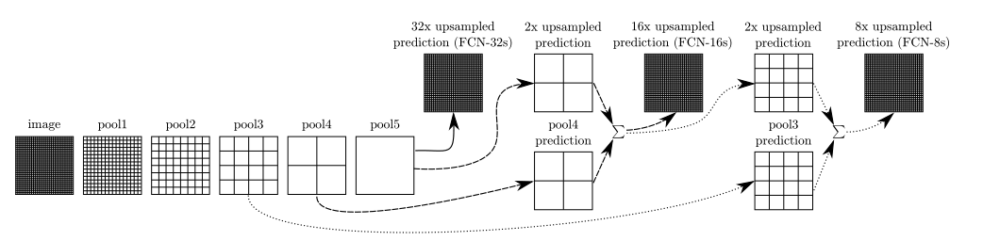

# Fully Convolutional Network

## Introduce

全卷积网路是为了语义分割任务所提出来的一种网络，将图像输入卷积网络，最后对每个像素进行分类预测(原文：Dense Prediction)。

全卷积网路和传统分类网络大部分一样，主要区别在于

1. 传统CNN最后将Feature Map通过Fully Connection层将特征向量展开成一维向量，最后对每个类别输出预测的概率。
2. FCN最后将Feature Map 不通过全连接层，而是继续通过卷积层。最后通过反卷积对HeatMap进行扩大回原图大小
3. CNN只能输入固定长宽的图片，不能自适应图片长宽，否则要对原数据进行裁剪以及变化
4. FCN支持任意大小的数据，可以自适应变化

### 传统CNN网络结构

通过卷积和池化操作，原图尺寸开始缩小，最后通过$(Channel \times {width \over stride} \times {height \over stride})$ 的维度变化，通过全连接层最后输出$(Class \times 1 \times 1)$维的数据

### FCN网络结构（FCN-32s）

FCN在全连接层取而代之的是卷积层，网络在经过Conv-Pool变化后最后得到的是$(Channel \times width \times height)$ 的图像，然后通过卷积**对高通道的数据进行降通道，一般将高通道降到 [类别数+1(background 类别)] ** ，然后通过反卷积或者转置卷积对原来低分辨率的图进行扩大，扩大至原图大小。

整个网络最开始输入$(500 \times 500 \times 3)$的图片，每通过一个$(Conv-Pool)$ 长宽降为原来的一半，依次通过五个一样的结构。最后输出的尺寸为原来的$1 \over 32$。
$$
\begin{array}{c|c}
layer & size \\ 
\hline
(Conv-Pool)_1 & {size \over 2} \\
(Conv-Pool)_2 & {size \over 4} \\
(Conv-Pool)_3 & {size \over 8} \\
(Conv-Pool)_4 & {size \over 16} \\
(Conv-Pool)_5 & {size \over 32} \\
\end{array}
$$

在$(Conv-Pool)_5$将输出数据通过一个$kernel = (1 \times 1),stride = 1,padding = 0$的卷积，输出$({size \over 32} \times {size \over 32} \times (Class+1))$。直接将这个扩大32倍恢复到原来图像大小叫做FCN-32s

### FCN-16s

FCN-16s是在FCN-32s的基础上，将$(Conv-Pool)_4$ 的输出与$(Conv-Pool)_5$ 扩大2倍的输出相叠加**（Skip Layer）**。在扩大16倍恢复成原来大小

### FCN-8s

过程同上。

论文原图：

## Reference

[FCN的学习及理解（Fully Convolutional Networks for Semantic Segmentation）](https://blog.csdn.net/qq_36269513/article/details/80420363)

[[全卷积网络 FCN 详解](https://www.cnblogs.com/gujianhan/p/6030639.html)]

