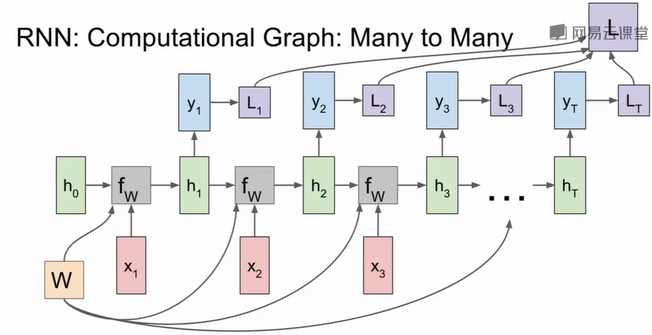

# CS231n

## 1.数据驱动

1. L1距离（曼哈顿距离）$d_1(I_1,I_2) = \sum_{p}|I_1^p - I_2^p|$
2. L2距离（欧氏距离）$d_2(I_1,I_2)= \sqrt{\sum_{p}(I_1^p - I_2^P)^2}$
3. K-Nearest Neighbors

## 2.K-Nearest Neighbors

​		对于样本$x$，选择训练集中距离（L1距离、L2距离）样本$x$最近的$K$个点，进行标签类别$y$投票，投票的类别数最大的类别就是样本$x$的类别

### 数据集的划分{#datasetDivide}

1. 合理的做法是将数据集划分成train、validation、test三个数据集，在训练集上训练，在验证集上用不同的超参验证模型效果，选择最好的一组超参数在测试集上进行测试

2. Cross-Validation(交叉验证)

   将数据集划分训练集和测试集，然后在训练集上等分成N份，在里面可以挑选一份作为验证集


K-Nearest Neighbors 在图像分类中并不常用原因如下：

1. 测试时间过长
2. L1或者L2用在图像上不太合适，图像整体的变动并不会导致距离的变化

## 3.线性分类

### 1.损失函数

定量估计权重$w$好坏的函数叫做损失函数:
$$
L(w) = {1 \over N}\sum_{i=1}^NL_i(f(x_i,W),y_i)+\lambda R(W)
$$
损失函数+一个**惩罚项（正则化项）**，在于寻找最小的损失的同时寻找最简单的模型（奥姆剃刀理论）

模型的复杂程度利用权重的L2来衡量$||w||_2$

#### Multiclass SVM loss(多分类SVM)

多分类SVM损失函数 $L_i = \sum_{j \ne y_i}max(0,s_j-s_y+1)$

$s_y$表示准确分类的得分，$s_j$为错误分类的得分，+1设置的偏置值

我们期望的是正确分类的得分越高越好，而错误分类的得分越低越好，见如下的例子
$$
\begin{array}{c|lcr}
类别 & \text{Pic1} & \text{Pic2} &\text{Pic3} \\
\hline
Cat & \mathbf{3.2} & 1.3 &2.2\\
Car & 5.1&\mathbf{4.9}&2.5\\
Frog & -1.7 & 2.0 & \mathbf{-3.1}\\
\end{array}
$$
Pic1的真实类别是Cat，Pic2的真实类别是Car，Pic3的真实类别是Frog

所以$L_{pic1} = max(0,5.1-3.2+1)+max(0,-1.7-3.2+1)$

### 正则化项

##### 1. L2正则化项：$R(w) = \sum_k\sum_l W_{k,l}^2$

##### 2. L1正则化项:

$R(w) = \sum_k\sum_l|W_{k,l}|$ 。L1范数表示求得矩阵中非零值的个数。可以看做鼓励稀疏矩阵

##### 3. 弹性网络正则化(Elastic Net)：

$R(w) = \beta L_2+L_1 =  \sum_k\sum_l \beta W_{k,l}^2+|W_{k,l}|$

##### 4. 最大正则化：

##### 5. Dropout：

在每次正向传播的时候，将一部分神经元（激活函数）置为0，通常可以用在卷积层和全连接层，用在卷积层的时候，通常需要将某一个通道上的数据置为0。原理：网络可以通过零散的特征来学习目标，而不是所有的特征，可以抑制过拟合

测试的时候，我们得到的结果为：$ y =f(x) = E_z[f(x,z)] = \int p(z)f(x,z)， p(z) 为z的概率，z为神经元丢弃的随机值$ 

我们只能通过大量的采样来接近这个结果，

考虑两个神经元的情况下，参数分别为$w_1,w_2$ 测试的时候我们能拿到的结果有
$$
\begin{array}{c|cccc}
\hline
结果 & w_1x+w_2y & 0x+w_2y & w_1x+0y & 0x+0y \\
\hline
\end{array}
$$
所以对结果的期望有$E[a] = {1 \over 2} (w_1x+w_2y)$

对于一般情况，**神经元以概率$P$ 置0，那么对于输出的期望为** $E[a] = p \times output$

###### 技巧：反转Dropout

为了测试的时候尽可能的提高效率，对于训练的时候在每层神经元输出的时候除以概率$P$ ,在训练的时候可以省略这个乘法操作

##### [6. 批量归一化](#5.批量归一化)

见锚点

##### 7.批量正则化

随机选取训练集的一个批次，进行训练。用剩下的数据进行测试。每个元素都可能出现在不同的批次中，可以减少过拟合的现象

#### Softmax Classifier

对于计算出来的得分我们对其使用指数函数将其映射到大于0的值， 然后通过归一化到$(0,1)$之间，然后得到损失函数$L_i = - \log({{e^{s_{y_i}} \over {\sum_j e^{s_j}}}}) ，y_i$为该图片的实际类别


### 2.优化 Optimization

#### 梯度下降

对于损失函数$L(w)$，我们需要求得一组$w$ 使得损失函数最小，所以我们对损失函数中的$w$求偏导，得到$L(w)$和$w$的变化关系，找出使损失函数下降的权重变化方向，并更新权重。
$$
w = w - \alpha {\partial L(w) \over \partial w} \\
\begin{cases}
{\partial L(w) \over \partial w} \gt 0,增区间所以w = w - |\partial| \\[2ex]
{\partial L(w) \over \partial w} \lt 0,减区间 w = w + |\partial |
\end{cases} \\

{\partial L(w) \over \partial w} ={ \partial {1 \over N}\sum_{i=1}^NL_i(f(x_i,W),y_i)+\lambda R(W) \over \partial W}
$$
可以看到偏导数是关于$x,w$的函数，需要样本来计算梯度。所以选择样本的方式也衍生出了不同的优化方案

#### BGD：batch Gradient Descent

对所有的样本求梯度平均值然后更新
$$
w = w - \alpha {1 \over N}\sum_{i=1}^N{\part L(w,x_i) \over \partial w}
$$
好处是一定能得到最优解，坏处是计算特别耗时

#### SGD:随机梯度下降(Stochastic Gradient Descent)

每个随机选择一个样本进行梯度更新
$$
w = w - \alpha {\part L(w,x) \over \part w}
$$


好处是，计算速度加快

缺点：准确度下降，可能会收敛到局部最优解

#### MSGD：Minibatch Stochastic Gradient Descent

每次迭代使用一个批次，批次有m个样本来更新权重
$$
w = w - \alpha {1 \over m}\sum_{i=1}^m{\part L(w,x_i) \over \partial w}
$$
是上面两种的折中方案

#### SGD+Momentum


$$
v_{t+1}= \rho v_t+\nabla f(x_t) \\
x_{t+1} = x_t - \alpha v_{t+1}
$$
$v_{t+1}$ 为在梯度方向上的速度，$x_{t+1}$为梯度，通过叠加$v$使梯度在速度的方向上步进而不是在原有梯度上步进，其中$\rho$为可学习超参数（摩擦系数、通常定义为0.9、0.99）$\alpha$为学习率

#### Nesterov Momentum


$$
v_{t+1}= \rho v_t - \alpha\nabla f(x_t+\rho v_t) \\
x_{t+1} = x_t + v_{t+1}.\\
令\  \hat x_t = x_t + \rho v_t \rightarrow \hat x_{t+1}  = x_{t+1} + \rho v_{t+1} \\
\hat x_{t+1} = x_t + v_{t+1} + \rho v_{t+1} \\
\hat x_{t+1} = \hat x_t - \rho v_t  + (1+\rho)v_{t+1} \  (*)
$$
计算当前速度和前速度的差来计算梯度的走向，通过因式替换可以得到式子*，这个式子就是更新权重的计算式子，其中包含了当前速度和之前速度

#### AdaGrad

维持一个变量 += 梯度的平方和，并在更新权重的时候除以这个 变量的开方，为了不让除数等于0，添加一个偏置$1e-7$
$$
grad += dx^2 \\ 
x -= {learning\_rate * dx \over \sqrt {grad}}
$$


如果在某一维上的梯度特别大，除以他的累计梯度那么可以降低他在该维度上的梯度变化

随着更新次数的增加，累计梯度会变得越来越大，最后会导致步长越来越小

对于非凸函数效果并不好

#### RMSProp

AdaGrad的变种


$$
grad  = \alpha \times grad + (1- \alpha)dx^2 \\
x -= {learning\_rate * dx \over \sqrt {grad}}
$$
增加一个权重$\alpha$控制，累加权重平方和和当前权重平方，使累加权重按照一定的比率衰减

#### Adam


综合上述的SGD-Momentum和AdaGrad

缺点，对于初始化的时候first_moment,second_moment都初始化为0，而对于衰减系数beta1,beta2大多数在0.9/0.99这样那么得到的first_moment,second_moment都会很小，导致第一步的步长会很大，这个问题来源于初始化

所以提出了改进版


对first_moment,second_moment做一个关于时间$t$的偏执校正

#### 牛顿法

#### 拟牛顿法

#### L-BFGS

## 4.反向传播

### 计算图：

对于式子$(x+y)*z,x=2,y=3,z=4,{\part(x+y)*z \over \part x} = z*1 = {\part(x+y)*z \over \part y}$ 构建计算图如下：


**上游的梯度$\times$当前式子对某一分支梯度后，作为该分支的上游梯度传给该分支**

本地梯度即对该变量求导

所以加法式子$ax+by$，对每一个分支$x|y$求梯度后都等于他的系数，本地的两个分支梯度分别为$a \times local\_gradient,b \times local\_gradient$

如果一个节点为多个分支的和，那么分支流回来的梯度之和才为该节点的总梯度

**思考：为什么反向传播的第一个梯度是1**

上游没有梯度，只有本地梯度且为1

#### Sigmoid Function

$$
\sigma(x) = {1 \over 1+e^{-x}} \\
{\part \sigma(x) \over \part x} = {e^{-x} \over (1+e^{-x})^2} = (1-\sigma(x))\sigma(x)
$$

Sigmoid Function的计算图


### 向量求导

输入一个向量$\overline x$经过函数变换后$f(\overline x)$ 求${df(x) \over dx}$等于一个**雅阁比**矩阵，即$f(x)$的每个元素关于输入向量的每个元素求导
$$
x = (x_1,x_2,\ldots,x_n) \\
f(x) = (y_1,y_2,\ldots,y_m) \\
{df(x) \over dx} = 
\begin{pmatrix}
{\part y_1 \over \part x_1} & \part y_1 \over \part x_2 & \cdots & \part y_1 \over \part x_n \\
{\part y_2 \over \part x_1} & \part y_2 \over \part x_2 & \cdots &\part y_2 \over \part x_n \\
\vdots & \vdots & \vdots & \vdots\\
{\part y_m \over \part x_1} & \part y_m \over \part x_2 & \cdots &\part y_m \over \part x_n \\
\end{pmatrix}
$$
**对于某个变量求导得到的梯度向量应该同变量有相同的shape**

## 5.神经网络

### 1. 卷积层

卷积输出尺寸的公式：

对于一个三通道的图像$W\times H \times Channel$ 那么卷积核也应该有三通道$w\times h\times c$ 并且对当前区域计算后得到一个值

对于一个长宽都是N，卷积核大小为F$\times$F

**无padding**：那么输出的大小为${(N-F) \over stride }+1$ ，$stride$为步长

**有padding**: 输出大小为 ${{(N +2 \times padding -F) \over stride} +1}$

### 2. 池化层


### 3.激活函数

  #### sigmoid function 

$\delta(x) = {1 \over 1+e^{-x}} \in [0,1]$


缺点：

1. 该式子会导致梯度消失： 当x在sigmoid的饱和区域时，梯度会衰减为0
2. 非zero-centered函数：当神经元输出全是正数或者负数时，那么对w的梯度将总是正数或总是负数，那么梯度的更新只会朝着同一方向更新。这对于梯度下降来说是低效的。所以我们一般情况下使用均值为0的数据
3. exp计算代价高

#### tanh

$\tanh(x) = {\sinh x \over \cosh x} \in [-1,1],\sinh x = {e^x - e^{-x} \over 2},\cosh x = {e^x + e^{-x} \over 2}$


缺点：梯度消失

#### ReLu(常用)

$f(x) = \max(0,x)$


在正数区间不会产生饱和现象，计算简单，并且收敛比Sigmoid和Tanh要快（6倍） 

缺点：

1. 非zero-centered函数
2. 正半轴不会产生饱和，但负半轴会

#### Leaky ReLU

$f(x) = \max (0.01x,x)$


#### Parametric Rectifier(PReLU) 参数整流器

$f(x) = \max(\alpha x,x)$

#### 指数线性单元ELU

$$
f(x) = 
\begin{cases}
x & if x \gt 0\\
\alpha (exp(x) - 1) & if x \le 0 \\
\end{cases}
$$

### 4.数据预处理


#### 1.标准归一化

将原始数据集归一化为均值为0、方差1的数据集，$x^* ={ x- \mu \over \delta}$

$\mu$为所有样本的均值，$\delta$样本的标准差

#### 2.最大最小归一化

将原始数据线性化的方法转换到$[0,1]$的范围 $x^* = {x - x_{min} \over x_{max} - x_{min}}$

$x_{min}$ 为样本的最小值，$x_{max}$样本的最大值

### 3. PCA

在减少需要分析的指标同时，尽量减少原指标包含信息的损失，以达到对所收集数据进行全面分析的目的。由于各变量之间存在一定的相关关系，因此可以考虑将关系紧密的变量变成尽可能少的新变量，使这些新变量是两两不相关的，那么就可以用较少的综合指标分别代表存在于各个变量中的各类信息。主成分分析与因子分析就属于这类降维算法

**PCA的主要思想是将n维特征映射到k维上，这k维是全新的正交特征也被称为主成分**

选取过程：选取样本中方差最大的方向的坐标轴 $x_1$加入集合$X$ ,然后从生下的坐标轴集合中选择与$X$ 所有坐标轴正交切方差最大的方向的坐标轴，以此类推通过这种方法获得新的坐标轴。而事实上最后的几个正交坐标轴方差接近几乎为0，故可以忽略，已到达降为的目的。

计算方法：计算数据矩阵的协**方差矩阵**，然后得到协方差矩阵的**特征值、特征向量**，选择**特征值**最大(即方差最大)的k个特征所对应的**特征向量**组成的矩阵。这样就可以将数据矩阵转换到新的空间当中，实现数据特征的降维。

对于方阵求特征值、特征向量，叫做**特征值求解**

对于非方阵求特征值、特征向量，需要用到**奇异值分解（SVD）**

#### 特征值分解

对于方阵$A$ 有 $Ax = \lambda x \\ \rightarrow A_{M \times M} = Q \Lambda Q^{-1}.cond:(Q中特征向量为行向量)\\ \rightarrow A_{M \times M} = Q^{-1} \Lambda Q.cond:(Q中特征向量为列向量) $

求解方法：
$$
Ax = \lambda x \Rightarrow |A - \lambda E|x = 0 \\
解：|A - \lambda E |= 0 \\
行列式变化该矩阵,求出\lambda_1,\lambda_2,\ldots,\lambda_n
\begin{bmatrix}
a_{1,1}- \lambda &a_{1,2}& \cdots & a_{1,n} \\
a_{2,1} & a_{2,2} - \lambda & \cdots & a_{2,n} \\
\vdots & \vdots & \vdots & \vdots \\
a_{n,1} &a_{n,2}& \cdots & a_{n,n} - \lambda \\
\end{bmatrix} \\
并解得特征向量
$$


#### 奇异值分解SVD

对于一个$M \times N$的矩阵$A$ 找到两个方阵$U,V$使得$A = U\Sigma V^T$成立记为奇异值分解，其中$UU^T = I,VV^T = I,U,V$都是正交阵

其中$\Sigma$除了对角线上的元素外其余元素都为0，他的值称为奇异值。

样本均值：$\overline x = {1 \over n} \sum_{i=1}^N x_i$

样本方差：$S^2 = {1 \over N-1}\sum_{i=1}^N(x_i - \overline x)^2$

样本协方差：$Cov(x,y) = E[(x-E(x))(y-E(y))] = {1 \over n-1}\sum_{i=1}^N(x_i- \overline x)(y_i - \overline y) $

协方差阵：
$$
Cov(x,y,z) = 
\begin{bmatrix}
Cov(x,x) & cov(x,y) & cov(x,z) \\
cov(y,x) & cov(y,y) & cov(y,z) \\
cov(z,x) & cov(z,y) & cov(z,z)\\
\end{bmatrix}
$$


奇异矩阵的求法：

酉矩阵即为正交矩阵


#### 4.白化

##### PCA预处理

通过求得特征向量，将原始的数据，通过坐标映射到特征向量上是的原始数据尽可能有更小的相关性

##### PCA白化

在PCA的基础上对每一维做一个标准差归一化处理

##### ZCA白化

把PCA白化的结果转换到以前的坐标系

### 5.权重初始化

#### 小随机数

从满足概率分布（高斯分布\正态分布）$N(0,0.01)$的样本中选一个小的随机数来初始化权重

$W = 0.01 * np.random.randn(D,H)$

适用于小网络，在深度网络上会使得激活值变得越来小最后大部分分布在0上，对于下一层的本层梯度也会特别小，所以会导致梯度消失

即使使用大的系数，会导致激活的时候会大部分处于饱和状态，梯度并不会更新 

#### Xavier初始化

目标：每一层输入与输出的方差应该尽量相等$ Var(x_{in}) = Var(x_{out})$

对于$w,x$服从均值为0，方差为$\delta$的高斯分布，

那么$w*x \to N(0,\delta_w * \delta_x),w_1*x+w_2*x \to N(0,2\times \delta_w * \delta_x)$ 

所以对于$\sum_{i=1}^m w_i*x_i \to N(0,M\times \delta_w * \delta_x)$ 

对于输出的方差即$M\times \delta_w \times \delta_{x-in} = \delta_{x-in} \to M\times \delta_w = 1 \to \delta_w = {1\over M}$

**在正向传播中**，每一层的权重矩阵应该服从于均值为0，方差为该层输入维度的倒数 $Subject\ to\ N(0,{1 \over x_{in}}^2) \ x_{in}为每层输入的维度$

**再反向传播中**，同样也应该服从于$N(0,{1 \over x_{out}}^2) x_{out} 为该层输出的维度$ 

因为输入维度和输出维度不一定会相等，所以我们一般取**方差为均值**$Var(w) ={ 2 \over X_{in} + X_{out}}$

所以我们对于权重矩阵在一段区间$[a,b]上的方差为：Var(w) ={(b-a)^2 \over 12 } = {2 \over X_{in} + X_{out}},令a = 0 \to b =\pm{ \sqrt{6} \over \sqrt{X_{in}+X_{out}} } $ 

所以**w的取值为服从均匀分布**$U(-{ \sqrt{6} \over \sqrt{X_{in}+X_{out}}},{ \sqrt{6} \over \sqrt{X_{in}+X_{out}}} )$ 即可

**Xavier初始化在Tanh作为激活函数的时候有很好的的表现**

缺点：**对于ReLu作为激活函数**，每次都会有一半的神经元被置为0，同样会导致最后的输入和输出集中在0附近，解决方案：**He 初始化**。

#### [He 初始化](https://www.cv-foundation.org/openaccess/content_iccv_2015/papers/He_Delving_Deep_into_ICCV_2015_paper.pdf)

对于ReLu函数：$W \ subject\ to \ N(0,\sqrt{{2 \over n_i}})$

对于Leaky ReLU：$W \ subject\ to \ N(0,\sqrt{{2 \over (1+a^2)n_i}})$

其中：$n_i = h_i*w_i*d_i$

 $h_i$为卷积核的高，$w_i$为卷积核的宽，$d_i$ 为卷积核的个数

### 5.批量归一化

使通过激活函数激活的值维持在同一个分布上，我们需要对每一层的**每一维**输出进行批量归一化。
$$
\hat x^{(k)} = {x^{(k)} - E[x^{(k)}] \over \sqrt{Var[x^{(k)}]}} \\
y_i = \gamma \hat x_i + \beta
$$
其中$x^{(k)}$为当前批次第K层**某一维**的输出，$E[x^{(k)}]$为该层的期望，$Var[x^{(k)}]$为该层的方差

其中$\gamma，\beta$是需要学习的参数，**通过学习这两个参数 尽量输出符合高斯分布的结果值**， 如果$\gamma = \sqrt{Var[x^{(k)}]} ,\beta = E[x^{(k)}]$ 那么输出的最终形式和原始形式是相同的，这就叫恒等映射，在实际中并不会一定学到这个恒等映射

**批量归一化层通常放在全连接层和卷积层之后，激活层之前**


## 6.神经网络训练步骤

#### 1.数据预处理

归一化，白化，PCA等等

#### 2.模型选择

#### 3.网络初始化

#### 4.网络训练

#### 5.调整学习率

 当损失太大导致NAN时，一般都是学习率太大导致

#### 6.[交叉验证](#datasetDivide)

在验证集上确认某一组超参数的训练效果最好

#### 7.随机搜索和网格搜索

确定超参数的时候，我们可以用对超参数在某一个范围内随机采样，这样采样得到的结果可能会好于网格搜索，

网格搜索：对于超参数设置某几个固定的值

## 7.数据增强

对于原始图像我们可以保持标签不变，对图像进行镜像翻转

### 1.随机裁剪图像

随机选取图像的一部分并缩放图片大小，进行训练


#### 2.色彩抖动

## 8.迁移学习

将训练好的模型迁移到另一个有着相似数据集上进行训练和测试

## 9.循环神经网络


循环神经网路的结构如上图

RNN每个节点都会有一个隐藏态$h$

隐藏态的更新公式为 $h_t = f_w(h_{t-1},x_t)$ $x_t$为当前态的输入

在当前隐藏态$h_{t-1}$的情况下$\times$隐藏态的矩阵$W_{hh}$ + 输入$\times$处理输入元素的矩阵$W_{xh}$ ，最后通过激活函数 $\tanh$
$$
h_t = \tanh (W_{hh}h_{t-1} + W_{xh}x_t) \tag {1}
$$
注意到每一个RNN节点都会输出自己对样本的预测值，所以在输出$h_t$后为了得到输出$y_t$ 会有一个关于$y_t$的矩阵来处理它。最后输出结果如下
$$
y_t = W_{yh}h_t \tag{2}
$$
RNN网络结构

 其中$f_w$的矩阵是共用的。这个矩阵在不同时刻接受不同的输入$x_n$和不同的隐藏量$h_n$,利用梯度下降更新该矩阵

RNN模型首先初始化隐层矩阵$h_0,W_{hh},W_{xh},W_{yh}$ 对于输入的一组数据$(x_0,x_1,x_2,\dots,x_n)$ 我们按照时序$t \in (0,1,2,\dots,n)$ 输入变量$x_t$利用公式$(1)$来计算下一个时刻的隐层矩阵$h_t$ 最后将$h_tW_{yh}$ 的结果通过$softmax$进行分类计算损失累加到总的损失上$L$，最后更具梯度下降更新$W_{hh},W_{xh},W_{yh}$ 矩阵

每次输入$x_t$会得到对应的损失$L_t$ 损失和就是RNN的总损失

### 梯度下降问题

因为要更具时序计算每次的损失并累计求和。如果序列过长会导致每次反向传播过程非常缓慢、占用内存较多。所以采用一种**Truncated Backpropagation**算法，对每进行$N$次前向传播就对模型进行一次反向计算。直到整个序列计算完

### RNN模型应用——图片描述

对于一张图片生成一段描述图片的文字

我们可以先对图片输入CNN进行特征提取通过全连接层后输入到RNN中

#### 带注意力机制的RNN模型

图片通过CNN后生成Features，输入到RNN中首层RNN更具特征的坐标分布对特征进行采样，将采样得到的特征和第一个单词输入到RNN中得到下一个采样的坐标分布和单词。单词组合起来就是基于注意力机制的RNN模型

##### 硬注意力机制

限制模型每一步只选择一个位置

##### 软注意力机制

对模型的位置进行加权

##### 梯度计算

对于RNN模型我们可以看到


RNN的结构式子可以得到如下的表达式：
$$
h_t = \tanh(W_{xh}x_t + h_{t-1}W_{hh}) = \tanh (
\begin{bmatrix}
W_{xh} & W_{hh}
\end{bmatrix}
\begin{bmatrix}
x_t \\
h_t-1
\end{bmatrix}
) = \tanh (W \begin{bmatrix}
x_t \\
h_t-1
\end{bmatrix}) \tag{1}
$$
通常情况下我们可以将矩阵$W_{xh},W_{hh}$拼接起来
$$
{\part h_t \over \part h_{t-1}} = {\part \tanh \over \part x}{ \part x \over \part h_{t-1}} = {\part \tanh(x) \over \part x} W_{hh}^T \\
{\part h_t \over \part x_t} = {\part \tanh \over \part x}{ \part x \over \part x_t} = {\part \tanh (x) \over \part x} W_{xh}^T
$$
可以看到经过多次的反向传播
$$
h_0 = {\part h_t \over \part h_{t-1}}{\part h_{t-1} \over \part h_{t-2}}\cdots{\part h_2 \over \part h_{1}} = ({\part \tanh(x) \over \part x})^t(W_{hh}^T)^t
$$
会有$t$个矩阵相乘，如果矩阵大于一会产生梯度爆炸，矩阵小于一会产生梯度消失

为了解决**梯度爆炸**的问题，通常使用梯度截断的算法：对求出的梯度矩阵计算$L_2$范式，如果大于某个阈值就用阈值与范式的比值将它缩小

```python
grad_norm = np.sum(grad * grad) #L2范式
if grad_norm > threshold:
    grad *= (threshold / grad_norm)
```

对于**梯度消失**的问题，一般换一个更加复杂的RNN结构 这也就是使用LSTM的原因

## LSTM （Long Short Term Memory）

LSTM与传统RNN结构的比较


LSTM相比较于传统的RNN多了一个$c^t$状态，并且更新的速度很慢

对于LSTM我们将输入$x_t$ 和上一状态传下来的隐藏量$h_{t-1}$ 通过分别初始化一个矩阵进行求解分别求出$z,z_i,z_f,z_o$

和普通RNN计算相似：我们也可以初始化一个矩阵$W_{final} = Concat(W,W_f,W_i,W_0)$ 用这个矩阵来和$x_{input} = Concat(x_th_{t-1},x_th_{t-1},x_th_{t-1},x_th_{t-1})$ 做乘法 求出最后的结果后进行分割 ，分别通过不同的激活函数得到$z,z_i,z_f,z_o$


可以得到如下的表达式：
$$
\begin{pmatrix}
i \\
f \\
o \\
g
\end{pmatrix} = \begin{pmatrix}
sigmoid \\
sigmoid \\
sigmoid \\
\tanh
\end{pmatrix}W
\begin{pmatrix}
h_{t-1} \\
x_t
\end{pmatrix}
$$


$z$是通过$\tanh$进行激活，取值范围在$(-1,1)$，

$z_i,z_f,z_o$ 通过$sigmoid$激活,取值范围在$(0,1)$ 来作为一种门控状态

这四个值输入到下面的结构中


$\bigodot$ 是矩阵的基本积（Hadamard product）——两个矩阵对应元素相乘 

$\bigoplus$ 是表示矩阵加法

$z_f = z_{forget}$表示忘记门控，来控制上一状态的$c_{t-1}$那些需要忘记

$z_i = z_{information}$ 表选择记忆门控，控制$z$中那些需要记住，那些可以不用记

$z_o = z_{output}$ 表示输出门控，控制最后的状态有哪些可以进行输出。

输出的$y_t$最后也是通过$h_t$变换得到 $y_t = sigmoid(W_{yh}h_t)$

## 图像分类与定位

### 思路

对一个带有bbox的图片，输入进CNN中，最后分别通过两个Full Connection，一个输出类别概率向量。一个输出候选框$bbox(x,y,w,h)$ 。分别使用不同的损失函数来计算两个全连接的损失，一个可以使用$softmax$ 一个可以对标注的bbox使用$L_1/L_2$ 范式。一般情况下可以通过超参数对两者进行加权计算总损失然后计算梯度

上述思路还有一种用法就是**姿态估计**

## Object Detection

与图像分类与定位不一样的是，目标检测中的目标可能有多个

### 思路一

滑动窗口法，对于一张图片创建一个窗口在每个区域进行滑动，最后通过图像分类对选中的窗口进行识别。

缺点：滑动窗口的大小不恒定，位置不恒定，计算量大，难以实现

### 思路二

**R-CNN**提出的区域候选区域法（proposals）：在一张图片中生成指定数量的候选框，然后通过CNN对候选框中的图进行分类。缺点运行慢，内存消耗大

**Fast R-CNN**：将图片通过CNN卷积层，对卷积层提取到的高分辨率特征图(feature map) 进行提取属于备选区域的卷积块。 在通过全连接层进行分类，由于一些卷积操作可以公用，所以会比RCNN处理要快


Fast R-CNN的损失：分类的损失+bounding boxes的损失 = Softmax Classifier + bounding-box regressorsv 

注意：因为候选框的大小不一致，所以我们需要对候选区域进行resize，这样才能确保全连接层输入的尺寸保持一致

**Faster R-CNN**：在Fast R-CNN上做了一点改进，Fast R-CNN的耗时主要是在候选框的计算上。所以Faster R-CNN 在图片通过卷积层获取高分辨率的卷积块之后，再通过一个候选框选择网络，用网络来预测候选框

## 图像检测与语义分割

### Mask R-CNN

