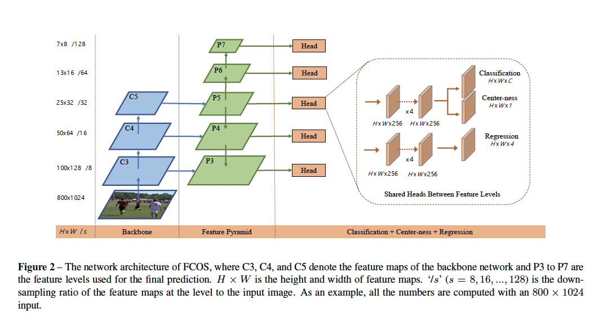

# FCOS-Fully Convolutonal One-Stage Object detection

## Abstract

RetinaNet,SSD,YOLOv3,Faster RCNN 都是通过预定义的Anchor来回归目标box。

**FCOS是没有Anchor的**

基于Anchor的检测器有如下几个缺点：

1. 超参数敏感的。超参数的调整能够导致4%的AP变化在COCO数据集上
2. 由于Anchor的固定检测器很难解决有大的形状变化的目标，特别对于小目标而言。同样预定义的Anchor有害于检测器的通用性。不同的任务需要不同的规模和宽高比的Anchor
3. 为了达到高的召回率，基于Anchor的检测器需要稠密的生成Anchor。这些大部分的Anchor都是作为负样本，会导致训练的时候正负样本个数并不均衡
4. Anchor会导致额外的IOU计算

新颖点：

我们观察到我们的方法会产生一些低质量的框，这些框里目标非常远

只有一层网络的"center-ness"分支来预测像素到对应box中心的偏移，用这个偏移来给低质量的框进行降权，然后合并进NMS的检测结果中。

优势：

1. 和其他全卷积任务统一起来了，例如语义分割
2. 变成无候选人，无Anchor的检测器，减少了设计的参数。
3. 避免了给每个Anchor重新标记的复杂计算。例如IOU计算和匹配
4. 我们SOAT了，并且FCOS可以替代RPN网络(Region proposal Network) 在两阶段的检测器中，并且效果要比原有的好
5. 少量的修改就可以用于其他任务，语义分割，关键点检测

## Related work

### Anchor-Base 

Anchor-Base的检测器这个想法是从传统的滑动窗口和基于候选框的检测器(Fast RCNN)得来的

Anchor-Box可以视为是一组预先定义的滑动窗口和候选框。这些框将会被用来分类为正例和负例的Patch。通过额外的偏移回归来微调bbox的定位。

因此Anchor box也被视为训练的样本

此处可以参考[RCNN、Fast RCNN、Faster RCNN](./目标检测相关框架解析.md)

### Anchor-Free

例如YOLOv1，YOLOv1在对象的中心点来预测bbox。

[CornetNet](../Tracking/CornetNet.md)  最近提出的一个Anchor-Free的网络，通过回归左上和右下的坐标，并进行后处理对两个坐标进行分组。一个额外的距离测量被学习用于候选分组

## Our Approach

第$i$层的网络结构输出为 $F_i \in \mathbb R^{H \times W \times C}$

$s$ 为到第$i$层位置的总共stride

Ground Truth ：$B_i = (x_0^{(i)},y_0^{(i)},x_1^{(i)},y_1^{(i)},c^{(i)})$ ，$(x_0^{(i)},y_0^{(i)})$ 为左上角的点，$(x_1^{(i)},y_1^{(i)})$为右下角的点，$c^{(i)}$为目标的类别

对于在Feature Map上的每个坐标$location(x,y)$ 通过公式$({\lfloor {s \over 2} \rfloor} + xs ,{\lfloor {s \over 2} \rfloor} + ys)$ 映射回输入图像上。映射回的坐标是感受野的中心坐标

**如果$location (x,y)$ 通过映射掉到任何一个GT的bbox中那么这个$location(x,y)$的类别标签就是这个GT的类别**

**否则就是负采样，标签类别为 0(表示背景类别)**

**同时回归出$\mathbf t^* = (l^*,t^*,r^*,b^*) $ ，这四个参数分别是该坐标距离bbox的四个边的距离**

**如果一个坐标映射掉入多个bbox。那么这个就被视为有争议的样本，我们选用最小面积的bbox作为他的回归标签**

### Loss Function

$$
L(\{p_{x,y}\},\{t_{x,y}\}) = {1 \over N_{pos}}\sum_{x,y}L_{cls}(p_{x,y},c_{x,y}^*) + { \lambda \over N_{pos}}\sum_{x,y}{\mathbb 1_{\{c_{x,y}^* > 0\}}} L_{reg}(t_{x,y},t_{x,y}^*) \tag 1
$$

$L_{cls}$是[Focal Loss](./FocalLoss.md)

$L_{reg}$是UnitBox的IOU损失

## Multi-level Prediction

对于特征金字塔网络，高的下采样倍率会导致相对较低的召回率。

对于Anchor-base的检测器来说可以通过降低IOU得分的阈值来弥补。也就是说将IOU得分低的也视为正样本。

而对于FCOS而言，可能会有比Anchor-base更低的召回率上限。因为不是每个目标都能在feature map里面找到坐标点。所以解决这个争议就是通过多阶段的预测

在特征金字塔的基础上，我们在不同级别的层上检测了不同尺寸的目标。

$P_3,P_4,P_5$是$C_3,C_4,C_5$通过一个$Conv(in,out,kernal \ size = 1\times1)$得到的特征图，

然后可以看到$P_3 \to P_7$ 每一层下采样都是上一层的两倍，$Conv(in,out,kernal\ size = 2\times 2,stride = 2,padding = 0)$

和Anchor-base中对每一个特征层设置不同尺寸的Anchor不一样。我们计算出 每一层中回归的目标：$\mathbf t^* = (l^*,t^*,r^*,b^*) $。如果回归目标满足下面不等式，那么这个目标就没有必要被回归出来。
$$
\max(\mathbf t^*) = \max(l^*,t^*,r^*,b^*) > m_i \\
\max(\mathbf t^*) = \max(l^*,t^*,r^*,b^*) < m_{i-1} \tag 2
$$
设计这个的目标是：更具每个级别的特征层所产生的感受野来动态调整回归的结果范围，对于低层的网络层，因为下采样率的倍数并不大。如果回归出来的距离四个边的距离过大或者过小，那么就说明这个回归是有问题的。因此是要当做负样本处理

**同样对于重叠的目标，一个坐标点对应多个GTbox，我们同样取用最小区域的GTbox作为目标**

## Center-ness

原因：因为大量的低质量的bbox是由远离目标中心的特征坐标点预测出来

所以，**定义一个Center-ness指标来衡量预测的好坏，来对远离目标中心的特征坐标做的预测进行降权**
$$
centerness^* = \sqrt{ {min(l^*,r^*) \over max(l^*,r^*)} \times {min(t^*,b^*) \over max(t^*,b^*)}} \in [0,1]
$$
左右距离比值乘以上下距离比值然后开根号

最后的box得分等于 $centerness^* \times classification \ score$ 

对box排序然后通过NMS的后处理得到最终的结果。

