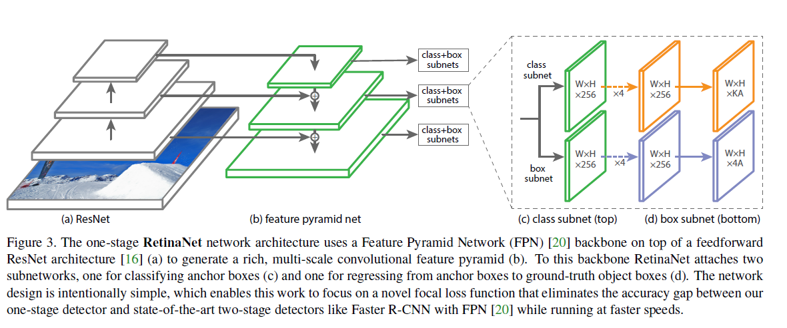

# Focal Loss

## Abstract

问题：发现前景和背景的采样类别的极端不平衡是训练稠密检测器的中心问题

解决：我们提出解决这个类别不平衡，通过标准交叉熵的改版来降低良好分类样例的损失。

## Introduction

我们定义类别的不平衡是阻止一阶段检测器达到SOTA准确率的主要障碍，用一个新的LOSS来消除这个障碍

类别不平衡是由类似RCNN的网络二阶段的级联和启发式采样产生的，

候选阶段(Selective Search算法，EdgeBoxes，DeepMask，RPN)通过广泛的降低候选区域到一个小的数量级，然后过滤掉大多数背景样本，

分类阶段，通过固定的前景和背景的比率进行启发式采样，或者(OHEM) 来维持可管理的前后景平衡

事实上，一阶段的检测器也需要处理大量的候选对象定位。实践中，大概有10万个稠密附带空间位置，尺寸还有宽高比的定位，

这个作为训练程序仍然被容易分类的背景样本所支配是无效的，传统的解决方法通过bootstrapping[33,29]，hard example mining[37,8,31]来解决

我们提出了一种新的损失函数来替代先前的方法来解决类别不平衡

这个损失函数是**一个动态比例的交叉熵损失**。比例因子会随着置信度的提高而衰减。**这个比例因子会自动对简单样本进行降权**

## Focal Loss

二分类交叉熵损失见下：
$$
CS(p,y) = \begin{cases}
-\log(p) & if \ y=1 \\
- \log(1-p) & otherwise
\end{cases} \tag 1
$$
其中$y \in \{ \pm1 \},p \in [0,1]$

y为正负样例的标签，$y = 1$为正样例，$y=-1$为负样例

$p$ 为$y = 1$时的概率
$$
p_t = \begin{cases}
p & if \ y=1 \\
1-p & otherwise
\end{cases} \tag 2
$$
对于这个损失我们可以很轻易的发现：**对于简单易分类的样本($p_t \gg .5$) 所产生的损失 $- \log(p)$ 在大量的简单分类样本求和之后，这个小损失会压倒罕见类别的损失** ——积少成多

### Balanced Cross Entropy

解决类别不平衡的方法，就是引入权重因子$\alpha \in [0,1]$，对于正类别 $class = 1$ 因子为$\alpha$

对于负样例$class = -1$ 因子为$1- \alpha$ 

实际中：$\alpha$ 会被设置为逆类的频率或者设置为交叉验证的超参数

所以重写式子$(1)$ 
$$
CE(p_t) = - \alpha \log(p_t) \tag 4
$$

### Focal Loss

简单分类的负样例贡献了大量的损失，主导了梯度，因此$\alpha$ 平衡了正负样例之间的重要性。反而我们提出重塑损失函数来降权简单样本，来聚焦训练在困难样本上

所以我们用一个因子 $(1-p_t)^\gamma$ 来调整权重。$\gamma \in [0,5]$
$$
FL(p_t) = - (1-p_t)^\gamma \log(p_t) \tag 4
$$
两个特性：

1. 当一个类别错误分类，并且概率很小的时候，因子$(1-p_t)^\gamma$ 接近1，loss并没有影响。当$p_t \rightarrow 1$ 时影响因子趋向于0，简单分类的样本就被降权了
2. 注意参数$\gamma$  当简单样本需要被降权的时候在光滑的调整它的比例，

当$\gamma = 0$ 的时候 $FL(p_t) = CE(p_t)$

### $\alpha $-平衡变体的FocalLoss 

$$
FL(p_t) = -\alpha(1-p_t)^\gamma \log(p_t) \tag 5
$$

**$\alpha $-平衡变体的FocalLoss 相比较非$\alpha $-平衡变体的FocalLoss对准确率显著的提升**

最后我们注意到：实行损失层和sigmoid 操作的结合来计算$p$ 获得了很大的数值稳定性

## RetinaNet 

使用FPN(Feature pyramid Network) 作为Retinanet的 backbone.

我们在在ResNet的头部层上构建FPN，我们重构了特征金字塔层$P_3 \to P_7$ ，每一层都是上一层的两倍下采样。所有的FPN都是256个通道。

RetinaNet使用特征金字塔 $P_3 \to P_7$

其中 $P_3 \to P_5$  是由对应的Resnet网路的残差结构 $C_3 \to C_5 $所计算出来 此处详情见 [FPN](./Feature Pyramid Network.pdf)

$P_6$ 由 $C_5$通过$Conv(in,out,kernal \ size= 3 \times 3,stride = 2)$计算出来

$P_7$ 由 $P_6$通过$Conv(in,out,kernal \ size= 3 \times 3,stride = 2) + ReLU$ 计算得到

### Anchor

使用和在FPN网络里相似的RPN变体的平移不变性的Anchor。Anchor的面积 $P_3 \to P_7 \in [32^2,512^2]$

在每一层特征上Anchor的宽高比都是$\{ 1:2,1:1,2:1 \}$

在每一层的我们添加Anchor的尺寸为$\{ 2^0,2^{1/3},2^{2/3} \}$

所以每一层有9个Anchor

**每个Anchor分配一个K维的One-hot向量，K为目标类别的个数，还有一个4维的框回归目标**

每个Anchor分配到与GTbox的IOU阈值为0.5 如果$IOU \in [0,0.4)$ 那就被分配为背景目标

如果一个Anchor有多个目标怎么办？

对于$IOU \in [0.4,0.5)$ 的目标将会被忽略。

**bbox回归计算出来的是Anchor的偏移**
