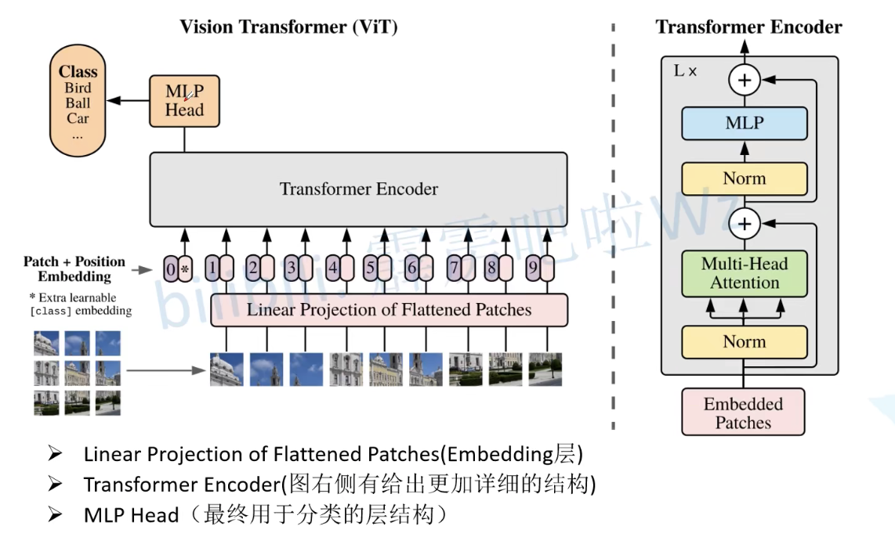

# Vision Transformer

## VIT 传统vision Transformer



1. 将每个图片等分成多个patch $(N)$，划分出来的patch可以重叠也可以不重叠，更具需求设定，可以使用一个滑动窗口从图片的左上角开始滑动，是否重叠取决于stride，因此可以用一个卷积核来实现该功能
2. 将每个patch输入Embedding层，得到$(N)$个输出向量(Token)
3. 然后在这个图片生成的所有Token前加入一个类别的Token，此处patch通过embedding层得到的向量和类别向量是相同维度的
4. 在$(N+1)$个Token前分别对每个Token加上一个位置向量
5. 输入到Transform Encoder，Encoder是有几个输入就会有几个输出
6. 我们提取Class Token对应的Encoder输出，通过MLP head 得到分类结果


### Embedding 层

Embedding层对于每个图片Patch的输入进行转换，转换成一个Token序列(二维矩阵)

因此对于输入图片可以通过一个卷积（Vit - B/16）来实现$Conv(input \ channel = 3,output \ channel = 768,size = 16 \times 16,stride = 16,padding = 0)$，提取出$(14 \times 14 \times 748)$ 的输出，然后对特征图在长宽上进行展开

```python
例：[224,224,3] --> [14,14,768] -展开-> [196,768]
```


#### 类别Token、位置Token

类别Token初始化一个可训练的向量$(1 \times 768)$，然后拼接到Embedding层的输出向量上 $(197,768)$，并且初始化一个可训练向量位置Token$(197 \times 768)$，与拼接后的向量进行叠加


