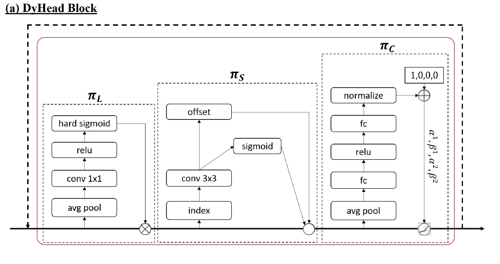

# dynamic Head

## Introduction

如何创建一个好的目标检测头，可以归纳为三个类别

1. 具有距离意识（scale-aware），大多数目标都有很大的规模，并且都会共存在一张图片里
2. 具有空间意识（space-aware），目标通常具有不同的形状，旋转以及在不同视角下有不同的定位
3. 具有任务意识（task-aware），目标可以有不同的代表性（bounding box,中心点，角点）

我们提出了一个dynamic head 来同时处理这三个意识问题。

如果假设一个backbone的网络输出是一个三维的张量 $level \times space \times channel$,

我们可以发现这是一个注意力学习的问题，直觉的解决方法就是在这个张量上构建一个全自注意力机器。然而计算代价和优化问题都太难

所以我们考虑在这三个维度上分开发展注意力机制

1. 距离意识的注意力模块依赖$level$维度的数据，学习各种语义级别的相对重要性，来适当的加强各个对象的特征
2. 空间意识的注意力模块依赖于$space$维度的数据，学习连贯有判别力的表示
3. 任务意识的注意力模块依赖于$channel$ 

## Related work

### Scal-awareness

利用图像金字塔[6,22,23]方法进行多尺度训练是有意义的。后来不仅图像金字塔，特征金字塔[14]通过拼接下采样卷积特征提高了有效性，并成为了对象检测的标准部件。不同级别的特征通常从不同深度的网络里提取出来，这就导致了语义鸿沟。[17]提出了通过特征金字塔由底到顶的路径增强来增强底层的特征。后来[18]通过介绍了一种平衡采样和平衡特征金字塔来提高了底层特征。最近[28]提出了基于3D卷积的卷积金字塔来提取尺度和空间特征相识性

### Spatial-awareness

**卷积神经网络在学习空间变换存在限制[36]**，为了缓解这个问题，一些模型[12,29]增大了模型的容量，或者加入昂贵的数据增强[13]，导致了在推理和训练的高计算代价。

一些新的卷积操作提出提高空间转换的学习，[31]提出使用**扩张卷积**来合并指数级增长的感受野内容信息。[7]提出了可变型的卷积来对空间位置进行采样。[33]通过学习到的特征重新定义了偏移

### Task-awareness

目标检测最开始是先产生目标候选人，然后对候选人进行分类成类别和背景。[Faster RCNN]形成了一个两阶段的框架：通过RPN网络将两阶段的定制到一个单一的卷积网络。后来单一阶段的目标检测[20]因为更加的高效变得更加受欢迎。[15]引入了特定任务分支提高了结构，超过了两阶段的精度并保持了一阶段的速度

近日，更多的工作展示了**各种各样的对象表示可以潜在的提高性能**。[11]首次展示了结合bounding box和语义标记信息能够更进一步的提高性能。[25]提出使用中心表示来解决目标检测在每个像素预测的方式。[32]进一步提高了基于中心点的方法的性能，更具对象的统计特性自动选择正负样例，[19]提出从每个边界的极端点中提取边界特征来增强点的特征，达到了目前最好的性能

## Approach

### Motivation

我们发现可以通过对特征金字塔的特征进行上采样或者下采样来缩放或者扩大到中等级别的特征。

重新缩放的特征金字塔可以定义为四维向量 $\mathcal F \in \mathcal R^{L \times H\times W \times C} $ ,$L$ 代表着特征层级的数量，$H,W,C$分别代表特征的高、宽和通道。我们定义$S = H \times W$ ，将四维向量在高宽上展开，变形为三维向量$ \mathcal F \in \mathcal R^{L \times S \times C} $

1. 目标规模的差异与不同级别下的特征是相关的，提高不同级别的特征的表示学习可以有益于规模感知
2. 不相似目标形状的几何转换和不同空间位置的特征相关，提高不同空间位置特征的表示有益于空间感知
3. 不同对象的表示和任务和不同通道特征相关，提高不同特征的通道的表示学习有益于任务感知

### Dynamic Head

给定的特征向量$\mathcal F \in \mathcal R^{L \times S \times C} $，

自注意力公式：$W(\mathcal F) = \pi(\mathcal F) \cdot \mathcal F$

$\pi(\cdot)$ 是注意力公式，通俗的计算方法是用全连接层来替代。但是在所有维度上直接学习注意力公式 是有计算代价的并且 因为高纬度的特征。实际上是不可负担的。

因此，我们将注意力公式转换为三个序列的注意力公式
$$
W(\mathcal F) = \pi_C(\pi_S ( \pi_L(\mathcal F) \cdot \mathcal F) \cdot \mathcal F) \cdot \mathcal F \tag 2
$$

#### Scale-aware Attention

我们 提出了一个规模感知的注意力机制来 基于她们的语义重要性 动态融合不同规模的特征，
$$
\pi_L(\mathcal F) \cdot \mathcal F = \delta(f({1 \over SC} \sum_{S,C} \mathcal F)) \cdot \mathcal F \tag 3
$$
$f(\cdot)$ 是线性方程近似与一个$Conv(input,output,kernel \ size = 1\times 1,stride = 1,padding = 0)$的卷积。

hard-sigmoid 函数：$\delta(x) = \max(0,\min(1,{x+1 \over 2}))$ 

#### Spatial-aware Attention

通过一个可变卷积核进行注意力学习，然后合并不同级别在相同空间位置的特征
$$
\pi_S(\mathcal F)\cdot \mathcal F = {1 \over L}\sum_{l=1}^L \sum_{k=1}^K w_{l,k} \cdot \mathcal F(l;p_k + \Delta p_k;c) \cdot \Delta m_k \tag 4
$$
$K$是空间采样位置的个数

$p_k + \Delta p_k$ 是通过自学习到的偏移坐标。

$\Delta m_k$ 是在位置$p_k$的自学习重要性标量,这些都是从中层特征中学习

#### Task-aware Attention

$$
\pi_C(\mathcal F)\cdot\mathcal F = \max(\alpha^1(\mathcal F)\cdot \mathcal F_C + \beta^1(\mathcal F),\alpha^2(\mathcal F)\cdot\mathcal F_C + \beta^2(\mathcal F)) \tag 5
$$

$\mathcal F_C$是第C个通道的特征

$[\alpha^1,\alpha^2,\beta^1,\beta^2]^T = \theta(\cdot)$  是动态relu[3]

##### Dynamic Relu

1. 全局平均池化层
2. 两个全连接层和正则化层
3. shifted sigmoid方法 正则化输出到$[-1,1]$

## Existing Detectors

### One-Stage Detector

一阶段的检测器通过密集的从特征图里面采样位置的特征，**传统的One-stage检测器(RetinaNet)组合骨干网络提取稠密特征和多个特定任务子网络分支来处理不同的任务**[3]。

最近 Anchor-free 的一阶段方法[FCOS,ATSS,RepPoint]，重新定制目标的**中心和关键点**来提高准确度

### Two-stage Detectors

整合边缘候选和ROI-pooling 层来从特征金字塔中提取中间表示，

