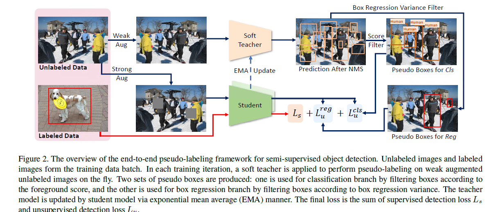

# 端到端的半监督学习

## Abstract

端到端的训练会逐渐提高伪标签的质量，越来越精确的伪标签反过来作用于目标检测的训练

我们提出了两个技术：

1. 一个soft teacher，每个未打标签的bounding box通过soft teacher网络进行分类打分并通过分数加权得到分类损失
2. 一个为框回归选择可靠伪框的框抖动方法(box jittering apporach)

## Introduction

对于半监督的目标检测，我们考虑基于伪标签的方法。伪标签方法是当前效果最好的方法。

[[27](#27),[36](#36)]考虑的是多阶段的训练，在第一阶段，使用有标签的数据对检测器进行初始化训练,其次是对伪标签处理的过程，然后是基于伪标签的重新训练。多阶段的方法可以达到很高的准确率，但是最后的效果受限于伪标签的质量和小部分数据训练出来的检测器并不是那么的精准。

所以我们提出了一个端到端的目标检测框架，进行伪标签标记的同时，在每次迭代时使用伪标签数据和部分有标签的数据进行训练。标签数据和伪标签数据通过预设的比例进行采样合成一个batch的数据。这个数据会应用到两个模型，一个是检测的训练（学生），另一个是伪标签的标记（老师）。老师模型是学生模型的[EMA](#ema)（指数移动平均）。

老师模型会评估所有学生模型生成的候选框，而不是给类别标签提供伪框和给候选框回归向量。直接评估会使得更广泛的监督信息应用到学生模型训练。准确来说，我们先对候选框通过有高前景阈值的检测分数分类为前景或者背景（算法[27](#27)），这个高的前景阈值会导致一些正例框被错误的分类到了背景。

为了解决这个问题，我们提出了使用**可靠的测量**来计算背景框的损失。我们发现教师模型的检测检测分数可以很好的作为可靠性度量。

另一种方法就是使用**box jittering（框抖动）**的方法，选择可信任的框来给学生模型进行定位训练。首先抖动候选伪前景框几次，这些框被教师模型的定位分支进行回归。计算方差用作可信任测量，带有高可信度的框会被用到学生定位分支的训练上

## Related Work

### 基于半监督的图像分类

分为两类：基于一致性[1,23,19,11]和基于伪标签[33,7,12]

基于一致性：未打标签的图像构建正则化顺势，以使同一图片不同的扰动产生相似的预测，扰动的方法包括：扰动模型，增强图像，对抗训练

基于伪标签：通过初始化的训练分类模型对未打标记的图像进行打标签，然后检测模型通过这些伪标签数据进行提炼

弱数据增强，不会改变图片和标签的性质，强数据增强有可能会改变图片和标签的性质，使得图片看不出来和标签吻合

### 基于半监督的目标检测

同图像分类，分为两类：基于一致性[10,28]和基于伪标签[20,36,13,27,31]

伪标签方法又有不同的做法：

1. 基于伪标签的方法中[20,36]：组合不同的数据增强的预测结果形成了未标记数据的伪标签
2. [13]，训练SelectiveNet网络选择伪标签
3. [31]，从未标记图像检测到一个框并粘贴到有标记的图片，然后位置一致性估计在粘贴的图片上进行工作

### 目标检测

两个主要流派：单一阶段的目标检测[17,21,30]和两阶段的目标检测[6,22,14,34,35]

这两个流派的主要区别在于是否使用级联过滤了大量的候选框。

## Methodology

学生模型通过两个检测器分别在标签数据和伪标签数据上的损失来学习。伪标签数据有两组伪框，分别用来驱动分类分支和回归分支。教师模型就是学生模型的指数移动平均（EMA）

### 端到端的伪标签框架

在每个训练迭代中，标签图片和没有标记的图片更具数据采样比率$s_r$ 随机采样形成一个训练数据批次，**老师模型通过没有标签的图片产生伪框**，学生模型在有标签和没有标签的图片上进行训练。有标签的数据以真实的groundtruth为标签，无标签的数据以老师模型产生的伪框为groundtruth，因此所有的损失定义为监督损失和无监督损失的权重和
$$
L = L_s + \alpha L_u \tag 2
$$
$L_s$ 监督学习的损失

$L_u$无监督学习的损失

$\alpha$ 控制无监督学习损失的比率

损失通过各自的图片数量进行正则化
$$
L_s = {1 \over N_l} \sum_{i=1}^{N_l}(L_{cls}(I_l^i) + L_{reg}(I_l^i)) \tag 3
$$

$$
L_u = {1 \over N_u} \sum_{i=1}^{N_u}(L_{cls}(I_u^i) + L_{reg}(I_u^i)) \tag 4 
$$

其中$I_l^i$ 表示第$i$个有标记的图片，$I_u^i$ 表示第$i$个无标记的图片

$L_{cls}$ 为分类损失，$L_{reg}$为框回归损失，$N_l$为有标记图片的数量，$N_u$为无标记图片的数量

按照常见的做法，老师模型被学生模型不断的通过EMA更新，

教师模型对一张没有标签的图会产生许多候选框，然后我们使用非极大值抑制(NMS)去除掉大部分的伪框。同时只有当候选框和前景分数(所有非背景类别的最大概率)大于一个阈值时才会保留为一个伪框

为了生成更高质量的伪框，我们采用了半监督图像分类的技术FixMatch[[26](#26)]，使用强数据增强在学生模型的检测训练上，弱数据增强在老师模型的打伪标签上

### Soft Teacher

高阈值的前景分数过滤学生模型生成的候选框要比低阈值的效果好

如果使用学生生成的候选框和老师生成的伪框的Iou来分配前景和背景的标签，一些前景框会被错误的分配成negatives 对象，这回损害表现，为了解决这个问题，我们提出了Soft Teacher，我们评估了学生生成的每个候选框成为真实框的可靠性。这个可靠性会被用在背景分类损失的权重里面，可靠性权重计算定义如下：
$$
L_u^{cls} = {1 \over N_b^{fg}} \sum_{i=1}^{N_b^{fg}}l_{cls}(b_i^{fg},G_{cls}) + \sum_{i=1}^{N_b^{bg}}w_jl_{cls}(b_i^{bg},G_{cls})  \tag 5
$$

$$
w_j = {r_j \over \sum_{k=1}^{N_b^{bg}} r_k } \tag 6
$$
$b_i^{fg}$为前景的框的集合 $b_i^{bg}$为背景框的集合。$N_b^{fg} 、N_b^{bg}$分别为这两个框集合的数量

$G_{cls}$为用于分类的伪框(老师模型生成)集合

$l_{cls}$ 为框的分类损失

$r_j$为第$j$个候选框的可靠性分数

其中带有弱数据增强的教师模型产生的弱背景分数可以很好的代理$r_j$指标

同样我们还评估了几个其他的指标

1. 学生模型的背景分数
2. 学生模型和老师模型之间的差异 $r = 1- |p_S^{bg}(b) - p_T^{bg}(b) |$
3. IOU

### Box jittering

教师模型生成的伪候选框，在这个框的周围采样一个抖动框然后输入教师模型得到一个细化的框

重复这个操作N次得到一个有N个细化框的集合$\hat b_{i,j}$ 定义定位可信度作为**框回归方差**
$$
\overline \delta = {1 \over 4} \sum_{k=1}^4 \hat \delta _k
$$

$$
\hat \delta_k = {\delta_k \over 0.5(h(b_i)+ w(b_i))}
$$

$\delta_k$ 是第$k$个抖动框（$ b_{i,j}$）的坐标的标准差

$\hat \delta_k$ 是上述标准差的正则化。

$h(b_i)、w(b_i)$分别代表候选框的高和宽

越小的方差代表着回归框的可信度越高

## Reference

<a name ="26">Fixmatch: Simplifying semisupervised
learning with consistency and confidence.</a>

<a name="27">A simple semi-supervised learning framework for object detection.</a>

<a name ="36">Rethinking pre-training and self-training.</a>

## 补充：<a name = "ema">EMA(指数移动平均)</a>

以指数递减的加权移动平均，用来估计变量的局部均值。

#### 1.加权平均

对于$N$个参数$(a_1,a_2,\ldots , a_n)$,加权平均为：
$$
V_{aver} = {1 \over N} \sum_{i=1}^N a_i
$$

#### 2.指数移动平均

$$
v_t = \beta v_{t-1} + (1- \beta)\theta_t \tag{1}
$$

$v_t$ 约等于最近的$1 \over 1-\beta $天的平均天气

$\theta_t$ 第t个参数值

$\beta$超参

将$\beta= 0.9$ 带入公式$(1)$求得
$$
v_{100} = 0.1 \theta_{100}+0.1\times 0.9 \theta_{99}+0.1\times0.9^2 \theta_{98} + \cdots + 0.1\times 0.9^{99} \theta_1
$$
所以$v$实际上是对最近的参数进行加权，距离当前$v$越近的参数权重越大。可以看到对于越远的参数，衰减是指数式的。