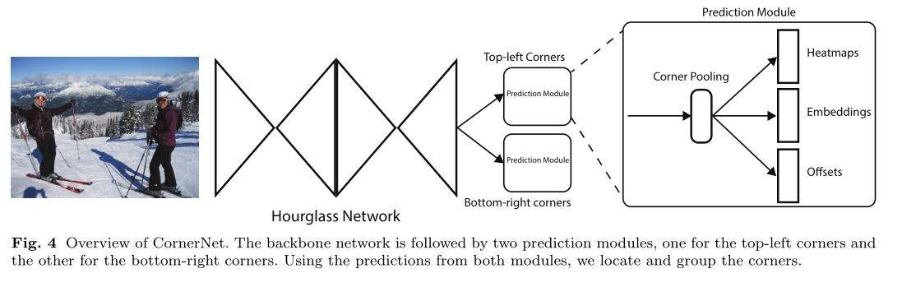

# CornerNet

## 1.Introduction

传统追踪使用基于Anchor的方法，来检测目标。用Anchor来截取出ROI(Region of interesting) 然后送入检测网络进行识别分类。但是基于Anchor的方法有两个缺点

1. 需要大量的Anchor。因为要训练检测器对Anchor进行分类是否和Groundtruth重叠。所以需要大量的数据。但是如果有大量的数据的话，势必导致正样本很少。正负样本的数量不平衡也会导致训练很慢
2. Anchor的引入会引入许多的超参数，例如锚点的尺寸，数量，长宽比等。在多尺度情况下会变得比较复杂

## 2.Corner pooling

两个featuremaps

1. 在每个像素点，对于每个通道，最大池化该像素点右侧的所有特征向量
2. 在每个像素点，对于每个通道，最大池化该像素点下侧的所有特征向量

根据上面求出的最大值做一个叠加，最后生成一个同大小的池化层 Featuremap $(N \times C \times Height \times Width)$

**优缺点**：

1. 比Anchor中心定位好，因为中心定位依赖四条边，而角点的定位只依赖两条边，因此相对而言会更简单
2. 角点池只需要$O(w\times h)$的角来代表$O(w^2 \times h^2)$的Anchor

### 1.Two-stage 算法

两阶段检测器（R-CNN,Fast-RCNN,Faster-RCNN），先生成一组ROI（Regions of Interest）区域，然后通过网路对每个ROI进行分类检测。早期的两阶段检测器（RCNN）会产生大量的冗余计算，再后来提出了Fast-RCNN对冗余计算进行了优化，在又来Faster-RCNN引入了区域提案网络（RPN）见[CS231n.md,Object Detection部分](../CS231n/CS231n.md)

### 2.One-stage 算法

一阶段检测器（例如，YOLO，SSD）消除了ROI，相比性能上能够和两阶段保持竞争力，同时有更高的计算效率

SSD密集的将锚框放置在多尺度的feature map上，直接对每个锚框进行分类。

YOLO则是直接通过图像预测边界框的坐标。然后转换成锚框。

但是YOLO和SSD会有正负样本不均衡的情况，所以会导致训练效率变低

因此发展出了RetinaNet，提出了一种新的Loss：**Focal Loss** 用来调整Anchor的权重

RefineDet 则提出了一种过滤器来减少负样本框的数量。

## 3.CornerNet

使用沙漏网络

1. 预测出两个Feature Map的集合。分别应用于对象的左上角和右下角的关键点，
2. 同样也预测了角点的嵌入向量使同一对象的两个关键点的嵌入之间的距离很小
3. 预测角点的偏移，调整角点的位置

沙漏网络后面是两个预测网络，每个预测网络都有自己的角池层，分别预角点的热图、嵌入向量(Embedding)、偏移

 网络结构：

HeatMaps $(N \times C \times H \times W)$ ,C为类别数，

惩罚：并不对所有位置的负位置(negative position)做相同的惩罚，在正位置(positive position)附近某个半径内的位置适当的减少了惩罚。因为角点在这个半径内构建的框同样能和groundtruth重叠很多

半径的确定：我们选择一对负位置生成的框与groundtruth 至少有$\tau > 0.3$ 

惩罚衰减量：通过非标准二维高斯分布给出 $e^{- {x^2 + y^2} \over 2 \delta ^2}$,中心是正位置，$\delta$是1/3的半径

## 4.Corner Group

一张图片里可能有多个对象，因此会检测出多个左上角和右下角，我们需要确认左上角和右上角是否来自同一个边界框。更具关联嵌入方法：通过嵌入向量的距离来对角进行分组，嵌入向量的值不重要。

$e_{t_k}$为对象$k$ 左上角的嵌入

$e_{b_k}$为对象$k$右下角的嵌入

$L_{pull}$ 为距离计算公式
$$
L_{pull} = {1 \over N} \sum_{k=1}^N [(e_{t_k}- e_k)^2 + (e_{b_k} - e_k)^2] \tag 1
$$
$L_{push}$ 为分组计算公式
$$
L_{push} = {1 \over N(N-1)} \sum_{k=1}^N\sum_{j=1,j \neq k}^N max(0,\Delta - |e_k - e_j|) \tag 2
$$
$e_k$为

