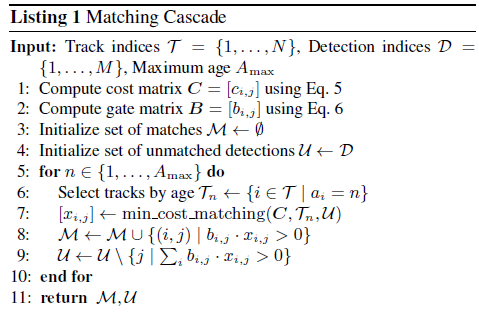

# Deep Sort

相比较SORT减少了45%的身份信息。将复杂度挪到了预训练上。

## Introduce

**SORT**：使用卡尔曼滤波和匈牙利匹配算法，SORT会返回较多的身份信息，关联度薪资只有在状态估计不准很低的时候才会比较准

```
SORT returns a relatively high number of identity switches. This is, because the employed association metric is only accurate when state estimation uncertainty is low.
```

所以会导致，对于遮罩的物体追踪效果并不好

**DeepSORT**：用一个在大规模行人重识别的数据集上训练好的CNN来区分行人

## Detail

对每个目标定义八个维度的信息$(u,v,\gamma ,h,\dot u ,\dot v, \dot \gamma,\dot h)$

$(u,v)$：表示bounding box中心坐标

$\gamma $ ：表示纵横比

$h$：表示高

$(\dot u ,\dot v, \dot \gamma,\dot h)$ 上述四个点在图像中分别对应的速度

然后使用定速的线性卡尔曼滤波器，对于每个追踪目标$k$进行计数：最后一次成功测量关联到当前帧的帧数 $a_k$

这个计数会在卡尔曼滤波预测的时候初始化，并且在关联到测量之后重置为0

如果这个计数$a_K > A_{max}$ 的时候可以考虑追踪的目标已经离开屏幕，然后从追踪的集合中删除

对于那些未被关联的追踪，在前三帧中归为暂定类，在这期间，如果三帧内未被成功关联，那么就会从追踪器中删掉

## Assignment

马氏距离：

单个数据点的马氏距离：
$$
D_M(x) = \sqrt {(x-\mu)^T {\sum}^{-1} (x-\mu)}
$$
数据点$x,y$之间的马氏距离为：
$$
D_M(x,y) = \sqrt{(x-y)^T {\sum} ^{-1}(x-y)}
$$
$\sum$ 是多维随机变量的协方差矩阵，$\mu$​为样本均值，如果协方差阵是单位向量也就是各个变量是独立同分布。马氏距离就是欧氏距离

文章使用马氏距离来衡量追踪器预测的框和测量框之间的差别
$$
d^{(1)}(i,j) = (d_j - y_i)^TS_i^{-1}(d_j - y_i \tag 1)
$$
$d_j$ 表示第$j$个检测框的位置，$y_i$ 表示第$i$个追踪器对目标的预测位置 $S_i$​ 表示检测位置与平均追踪位置的协方差矩阵。如果某次关联的马氏距离小于指定的阈值，则设置运动状态的关联成功

马氏距离并没有考虑相机移动导致的快速运动。所以同时用Cosine距离来衡量$i,j$​​之间的表现信息
$$
d^{(2)}(i,j) = \min\{1-r_j^Tr_k^{(i)}|r_k^{(i)} \in R_i\}
$$
对每一个检测坚果计算一个特征向量：$r_j$且有$||r_j|| = 1$

对每一个追踪目标保存一个$R_i$。是第$i$个​追踪目标成功关联的最近100帧的特征向量的集合。这种度量方式就是计算第$j$​​个检测结果与之前100帧特征向量的最小余弦距离。

Cosine距离对长期遮罩有效

马氏距离对短期预测有效

所以文章对上述两种方式做了一个加权和作为最终的衡量标准
$$
c_{i,j}= \lambda d^{(1)}(i,j) + (1-\lambda)d^{(2)}(i,j)
$$

## Algorithm


