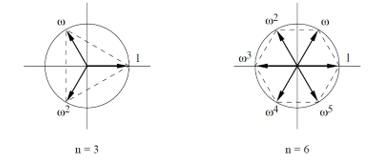
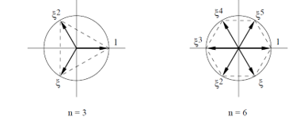

# KCF

## 前置理论

### 循环矩阵

如果一个矩阵为循环矩阵(circulant matrices)，那么该矩阵可以用一个向量表示
$$
X = C(x) = \begin{bmatrix}
x_1 & x_2 & x_3 & x_4\\
x_4 & x_1 & x_2 & x_3\\
x_3 & x_4 & x_1 & x_2\\
x_2 & x_3 & x_4 & x_1\\
\end{bmatrix}
$$
第一行由向量$x$来表示，随后的第$i$行为$x$向右循环移动$i$​次的结果

### 傅里叶矩阵

 对于正整数$n$，复数的集合$\{1,\omega,\omega^2,\ldots ,\omega^{n-1}\}$​，其中
$$
\omega = e^{2\pi i/n} = \cos({2 \pi \over n}) + i\sin ({2 \pi \over n})
$$
被称为$n$​阶单位根，这些根是方程$z^n = 1$​的解。从几何上来说他是单位圆内接$n$​正多边形的角所在的向量。当$k \ge n$​​​时根是循环的。有$\omega^k = \omega^{k \pmod n}$​



虚数集合$\{1,\xi,\xi^2,\ldots ,\xi^{n-1}\}$，其中
$$
\xi = e^{-2\pi i/n} = \cos({2 \pi \over n}) - i\sin ({2 \pi \over n}) = \overline \omega
$$
$\xi 与 \omega$**共轭**，从几何上来看，两者的区别在于$\omega$ 是逆时针取的，$\xi$​是顺时针取得



**性质**：

1. 如果$k$为整数，那么有$|\xi^k|^2 = 1 = \xi^k \overline {\xi^k}$​
2. $\xi^{-k} =\overline {\xi^k} = \omega^k$
3. 如下：

$$
(1+\xi^k+\xi^{2k}+\ldots+\xi^{(n-2)k}+\xi^{(n-1)k})\xi^k =(1+\xi^k+\xi^{2k}+\ldots+\xi^{(n-2)k}+\xi^{(n-1)k}) \rightarrow \\
(1+\xi^k+\xi^{2k}+\ldots+\xi^{(n-2)k}+\xi^{(n-1)k})(1-\xi^k) = 0，且 \xi^k \ne 1\rightarrow \\
(1+\xi^k+\xi^{2k}+\ldots+\xi^{(n-2)k}+\xi^{(n-1)k}) =0
$$

### 傅里叶矩阵

一个$n \times n$的矩阵，其$(i,j)$处的值为$\xi ^{jk}$ 。这样的矩阵被称为$n$阶傅里叶矩阵
$$
F_n = \begin{bmatrix}
1 & 1 & 1 & \dots & 1\\
1 & \xi & \xi^2 & \dots  & \xi ^{n-1}\\
1 & \xi^2 & \xi^4 & \dots &\xi ^{2(n-1)}\\
1 & \xi^3 & \xi^6 & \dots & \xi ^{3(n-1)}\\
\vdots & \vdots &\vdots &\vdots &\vdots \\
1 & \xi^{n-1} & \xi^{2(n-1)} & \dots & \xi ^{(n-1)(n-1)}\\
\end{bmatrix}
$$
由上述性质$1,2,3$​我们可以推断出，傅里叶矩阵的任意两行之间或者任意两列之间都是正交

且每一行的范数都是$\sqrt{n}$ 

所以在傅里叶矩阵前乘以一个正则化参数$1 \over \sqrt{n}$ 可以得到一个酉矩阵

### 循环矩阵傅里叶对角化

```
all circulant matrices are made diagonal by the Discrete Fourier Transform (DFT)
所有循环矩阵都可以通过离散傅里叶变化对角化得到
```

上述理论我们可以写成公式：
$$
X = Fdiag(\hat x)F^H \tag 1
$$
$F$：是常数傅里叶变换矩阵不依赖于$x$​，​
$$
F = {1 \over \sqrt{K}} \begin{bmatrix}
1 & 1 & 1 & 1\\
1 & \omega & \omega^2 & \omega^3\\
1 & \omega^2 & \omega^4 & \omega^6\\
1 & \omega^3 & \omega^6 & \omega^9\\
\end{bmatrix},复数 \omega = e^{-2\pi i/K} = \cos(2\pi/K) -i\sin(2\pi/K),K表示方阵的尺寸 \tag 2
$$
$F$​​矩阵是计算**DFT变换**的唯一矩阵$DFT(x) = \sqrt{n}Fx .其中n 是向量的尺寸$​​

**反傅里叶变换**：$x = {1 \over \sqrt{n}}F^{-1} \hat x$

性质：

1. 观察$F$​矩阵可以得知，这是一个**对称矩阵** $F = F^T$

2. 满足$F^HF = F F^H = I$​​ 这是一个**酉矩阵**，

   **酉矩阵的性质**：

   $F^H = F^{-1}$

   $F^{-1}$也是酉矩阵

   $det(F) = 1$

$F^H$​​：是$F$​​​的**共轭转置矩阵**
$$
F_{共轭} = {1 \over \sqrt{K}} \begin{bmatrix}
1 & 1 & 1 & 1\\
1 & \Omega & \Omega^2 & \Omega^3\\
1 & \Omega^2 & \Omega^4 & \Omega^6\\
1 & \Omega^3 & \Omega^6 & \Omega^9\\
\end{bmatrix}，\Omega = \cos(2\pi/K)+i\sin(2\pi/K).\\
因为F和F_{共轭}对称 \Rightarrow F_{共轭}=F_{共轭转置}=F_{H} \tag 3
$$
联立式子$(2,3)$​可得 $F^HF = I$​ [参考](http://www.lamda.nju.edu.cn/liyf/dip19/Ch10.pdf)

**欧拉公式**：$e^{ix} = cos(x)+isin(x)$

$x$​：是向量

$\hat x$​：是$x$​经过离散傅里叶变化之后的矩阵 $\hat x = DFT(x)$​​

$X$：是原向量$x$生成的循环矩阵
$$
X = \begin{bmatrix}
x_1 & x_2 & x_3 & x_4\\
x_4 & x_1 & x_2 & x_3\\
x_3 & x_4 & x_1 & x_2\\
x_2 & x_3 & x_4 & x_1\\
\end{bmatrix}
$$
对式子$(1)$做变换
$$
X = Fdiag(\hat x)F^H  \Rightarrow F^{-1}X(F^H)^{-1} = diag(\hat x) = F^HXF \tag 4
$$
可以看到，等于对$X$​​矩阵进行**对角化**。接下来利用特征值特征向量进行证明式子$(4)$​成立
$$
XF = Fdiag(\hat x) \Rightarrow
X \begin{bmatrix}
f_1 & f_2 & f_3 & \ldots & f_n
\end{bmatrix} = \begin{bmatrix}
f_1 & f_2 & f_3 & \ldots & f_n
\end{bmatrix} diag(\hat x) \tag 5 \\
$$

在$(5)$中$f_i$为$F$矩阵的列向量，

矩阵的行向量乘以对角阵等于对角阵乘以该矩阵的列向量$Fdiag(\hat x) = diag(\hat x)[f_1,f_2,\ldots,f_n]$

所有对于$(5)$有
$$
Xf_i = x_if_i \tag 6
$$
$x_i$​ 为矩阵$F$​第$i$​​列向量对应的特征值，等价于求证对角阵$diag(\hat x)$​和$F$​阵是一对关于矩阵$X$的特征值和特征向量

考虑$X$​循环矩阵中的第$i$​行的元素 $[x_{n-i+1},x_{n-1+2},\ldots x_n,x_1,x_2,\ldots,x_{n-i}]$​​

以$\begin{bmatrix} x_1 & x_2 & x_3 \\ x_3 & x_1 & x_2 \\ x_2 & x_3 & x_1 \end{bmatrix}$为例

考虑$F$​矩阵第$i$​列$[1,\omega^{i-1},\omega^{2(i-1)},\ldots,\omega^{((n-1)(i-1))}]^T$​

以$[1,\omega,\omega^2]^T$​为例
$$
Xf_i =\begin{bmatrix} 
x_1+x_2\omega+x_3 \omega^2 \\
x_3+x_1\omega+x_2 \omega^2 \\
x_2+x_3\omega+x_1 \omega^2 \\
\end{bmatrix} = \begin{bmatrix} 
x_1 & x_2 & x_3 \\ 
x_3 & x_1 & x_2 \\ 
x_2 & x_3 & x_1 \end{bmatrix} \cdot
\begin{bmatrix}
1 \\
\omega \\
\omega^2 \\
\end{bmatrix}
$$
对于$[1,\omega,\omega^2]^T \cdot \omega$​ ​​有
$$
Xf_i\cdot \omega =\begin{bmatrix} 
x_1\omega+x_2\omega^2+x_3 \omega^3 \\
x_3\omega+x_1\omega^2+x_2 \omega^3 \\
x_2\omega+x_3\omega^2+x_1 \omega^3 \\
\end{bmatrix},有\omega^N = \omega^{N \pmod k}.且:k=3，所以有\omega^3 = 1 \\
$$

$$
Xf_i\cdot \omega =\begin{bmatrix} 
x_3+x_1 \omega+x_2\omega^2 \\
x_2+x_3 \omega+x_1\omega^2 \\
x_1+x_2 \omega+x_3\omega^2 \\
\end{bmatrix} = \begin{bmatrix}
x_3 & x_1 & x_2 \\
x_2 & x_3 & x_1 \\
x_1 & x_2 & x_3 \\
\end{bmatrix} \cdot
\begin{bmatrix}
1 \\
\omega \\
\omega^2 \\
\end{bmatrix}
$$

上述主要是证明：循环矩阵可以拆分成离散傅里叶变换计算能够降低计算复杂度，也是KCF滤波器快的原因

## KCF原理

KCF通过循环矩阵傅里叶对角化能加快运算，这只是他运行比较快的原因，下面是分析他的原理


## Reference

[循环矩阵傅里叶对角化](https://blog.csdn.net/shenxiaolu1984/article/details/50884830)

[循环矩阵的傅里叶对角化](https://blog.csdn.net/ConquerHuang/article/details/102539033?utm_medium=distribute.pc_relevant.none-task-blog-2%7Edefault%7EBlogCommendFromMachineLearnPai2%7Edefault-3.control&depth_1-utm_source=distribute.pc_relevant.none-task-blog-2%7Edefault%7EBlogCommendFromMachineLearnPai2%7Edefault-3.control)
