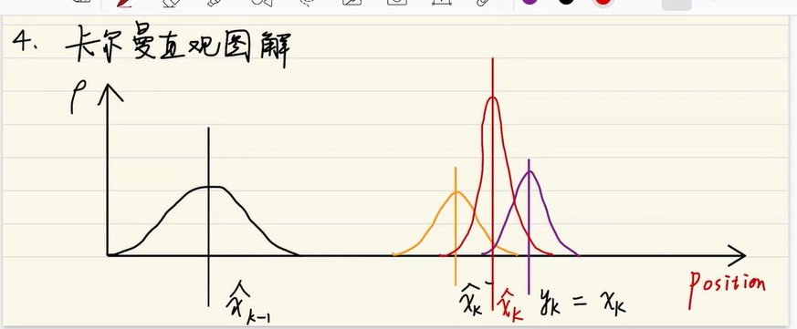

# Kalman Filter

卡尔曼滤波器是使用前一状态信息预测下一状态信息的滤波器

利用不确定性的动态信息来对系统下一步的走向做出有根据的预测。

### 例子

对于一个物体 $\hat x_k$ 我们使用速度 $v$ 和位置 $p$ 来描述他的状态 $p_k$ 为他的协方差矩阵
$$
\hat x_k = 
\begin{bmatrix}
position \\
velocity
\end{bmatrix},
p_k = \begin{bmatrix}
\sum_{pp} & \sum_{pv} \\
\sum_{vp} & \sum_{vv}
\end{bmatrix}
$$
使用基本的运动学公式来表示下一个点的状态
$$
P_k = P_{k-1}+\Delta t v_{k-1} \\
v_k = v_{k-1}
$$
将上式化成矩阵表示形式：
$$
\hat x_k = \begin{bmatrix}
position \\
velocity
\end{bmatrix} 
= \begin{bmatrix}
1 & \Delta t \\
0 & 1
\end{bmatrix} \cdot
\begin{bmatrix}
P_{k-1} \\
v_{k-1}
\end{bmatrix} = F_k \hat x_{k-1} \tag{3}
$$
这个$F_k$就是目标的预测矩阵，通过上一时刻$(k-1)$的状态得到下一时刻的预测状态。

同时更新协方差矩阵 我们对每个状态点乘以矩阵$A$ 能够得到如下:
$$
Cov(x) = \sum \\
Cov(Ax) = A\sum A^T \tag{4}
$$
结合方程$(4)$ 和方程$(3)$ 可以得到：
$$
\hat x_k = F_k \hat x_{k-1} \\
P_k =Cov(F_k X_{k-1}) =  F_k P_{k-1}F_k^T  \tag{5}
$$
但由于有外部因素对系统产生干扰，我们可以假设一个加速度$a$
$$
p_k = p_{k-1}+\Delta t v_{k-1} +{1 \over 2} a \Delta t^2 \\
v_k = v_{k-1} + a \Delta t \\
$$
表示成矩阵的话
$$
\hat x_k = F_k \hat x_{k-1} + \begin{bmatrix}
\Delta t^2 \over 2 \\
\Delta t
\end{bmatrix} a \\
= F_k \hat x_{k-1}+B_k \vec {u_k}   \tag{6}
$$
其中$B_k$ 称为控制矩阵，$\vec {u_k}$称为控制向量

原始估计中的每个状态变量 更新到新的状态后，任然服从高斯分布。我们可以说$\hat x_{k-1}$的每个状态移动到了一个新的服从高斯分布的区域，$w_k$ 表示预测的误差，对应的$Q_k$表示预测误差的协方差矩阵。 我们可以将$(5)$更新为如下：

### 预测方程

$$
\hat x_k = F_k \hat x_{k-1} + B_k \vec {u_k} + w_k \\
P_k =Cov(F_k X_{k-1}) =  F_k P_{k-1}F_k^T +Q_k  \tag{7}
$$

我们用传感器得到的值是满足一个高斯分布，观测值记为$z_k = \begin{bmatrix} z_P \\z_v\end{bmatrix}$

### 测量方程

$$
z_p = P_k + \Delta p_t  \\
z_v = v_k + \Delta v_t\\ \tag{8}
$$

$z_p = 当前的位置+噪声$ 将式子$(8)$写成矩阵形式有：
$$
z_k = \begin{bmatrix}1 & 0 \end{bmatrix} \begin{bmatrix}P_k \\ v_k \end{bmatrix} +\begin{bmatrix}1 & 0 \end{bmatrix}  \begin{bmatrix}\Delta p_t \\ \Delta v_t \end{bmatrix}
$$
将前面的矩阵记为观测矩阵$H$ 那么有下式子：

由于传感器同样带有不确定性我们在下式加上一个噪声$v$和噪声方差$R_k$
$$
z_k = Hx_k + v \\
Cov_K = HP_kH^T + R_k \tag{9}
$$
接下来就是使用测量的协方差矩阵分布和 预测方程的协方差矩阵分布求交集，得到最优估计，然后以这个最优估计作为当前的值

可以看出来**新的最优估计**是更具**上一最优估计**预测得到的,并且加上了已知外部控制量的修正

那么我们只需要将这两个高斯分布相乘既可以得到一个新的高斯分布这个分布就是两个分布最可能的值，也就是最优估计了

$\hat x_{k-1}$ 上一时刻的最优估计值

$\hat x'_k$ 预测值

$\hat x_k$ 最优估计值

$y_k$ 观测值

### 融合高斯分布

一维高斯分布：
$$
\N(x,\mu,\delta) = {1 \over \delta \sqrt {2 \pi}}e^{- {(x-\mu)^2 \over 2 \delta ^2}}
$$
两个服从高斯分布的函数相乘可以得到：
$$
N_1(x_1,\mu_1,\delta_1) \cdot \N_2(x_2,\mu_2,\delta_2)
= {1 \over \delta_1 \delta_2 2 \pi} e^{-({(x_1-\mu_1)^2 \over 2\delta_1^2}+{(x_2-\mu_2)^2 \over 2\delta_2^2})} \\
-({(x_1-\mu_1)^2 \over 2\delta_1^2}+{(x_2-\mu_2)^2 \over 2\delta_2^2}) = - ()
$$
重新标准化和归一化可以得到：
$$
\mu = \mu_1 + {\delta_1^2(\mu_2 -\mu_1) \over \delta_1^2+\delta_2^2} \\
\delta^2 = \delta_1^2 - {\delta_1^4 \over \delta_1^2+\delta_2^2} \tag{11}
$$
令$K = {\delta_1^2 \over \delta_1^2+\delta_2^2}$ 那么就可以得到
$$
\mu' = \mu_1 + K(\mu_2-\mu_1) \\
\delta'^2 = \delta_1^2 - K\delta_1^2 \tag{13}
$$

$$
转换成协方差矩阵形式，：K = {\sum_1 \over (\sum_1 + \sum_2)} \tag{14}
$$

$$
\vec\mu = \vec \mu_1 +K(\vec \mu_2-\vec \mu_1) \\
\sum' = \sum_1 - K\sum_1 \tag{15}
$$

矩阵$K$被称为卡尔曼增益

我们得到预测部分
$$
(\mu_0,\sum_0) = (H_k\hat x_k,H_kP_kH_k^T)
$$
测量部分
$$
(\mu_1,\sum_1) = (\vec z_k,R_k)
$$
将上式带入$(15)$算出它们之间的重叠部分
$$
H_K \hat x_k' = H_k \hat x_k + K(\vec z_k - H_k \hat x_K) \\
H_kP'_kH_K^T = H_kP_kH_K^T - KH_kP_kH_k^T \tag{16}
$$
由式$(14)$可得卡尔曼增益为：
$$
K = {H_kP_kH_k^T \over (H_kP_kH_k^T+R_k)} \tag{17}
$$
将$(17)$带入$(16)$ 左右两边同乘$H_k^{-1}$ 得：
$$
\hat x'_k =\hat x_k+K'(\vec z_k- H_k \hat x_k) \\
P'_k = P_k - K'H_kP_k \\
其中 K' = {P_kH_k^T \over (H_kP_kH_k^T+R_k)}
$$
$x'_k$就是新的最优估计，将$x'_k$和$P'_k$放到下一个预测和更新方程中不断迭代

其中$H_k\hat x_k$ 为$k$时刻的预测坐标

$H_kP_kH_k^T$ 为预测值的协方差矩阵

$\vec z_k$ 为测量的坐标

