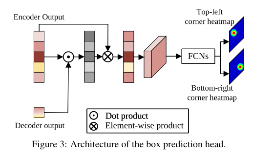
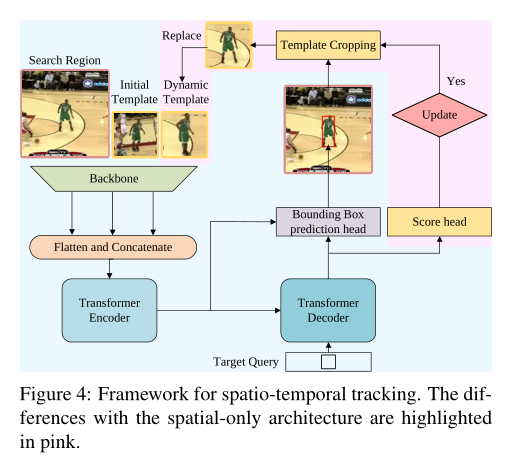

# STARK

## Introduction

在DETR的基础上做了一点改进，提出了一种利用时空信息进行目标追踪的端到端的算法，并且没有后处理（余弦窗口，规模或者宽高比惩罚项，bounding box光滑函数，基于轨迹的动态处理等）

## baseline

网路组成：一个卷积的主干网络，一个Transformer的编解码结构，一个Bounding box的预测结构

**Backbone**:vanilla ResNet，该网络的输入是一个图像对：初始目标对象的模板图片还有一个是当前帧的搜索区域

模板图片是$z \in \mathbb R^{3 \times H_z \times W_z}$​

搜索区域是$x \in \mathbb R^{3 \times H_x \times W_x}$

最后输出的是该两张图片的$C$ 维特征图

**Transformer Encoder**：将输入的$C$​​维特征图减少到$d$​​维，然后将$d$​​维的两个特征图按空间位置进行铺平拼接成$d$​​维 长度为$H_z \times W_z + H_x \times W_x$​​的向量输入到Encoder中

**Transformer Decoder**：输入一个查询用来预测目标对象的边界框

**Head**：先计算编码器输出和解码器输出计算相似度，用编码器的输出与相似度矩阵进行计算。加强相似度高的区域，减弱相似度低的区域。然后reshape后输入到全卷积层(卷积层 --> 批量正则化BN -->ReLU)。输出左上角坐标的概率和右下角的概率。然后通过加权得到最后的左上和右下的坐标
$$
(\hat x_{top\_left},\hat y_{top\_left}) = (\sum_{y=0}^H \sum_{x=0}^W x \dot P_{top\_left}(x,y),\sum_{y=0}^H \sum_{x=0}^W y \dot P_{top\_left}(x,y)) \\
(\hat x_{bottom\_right},\hat y_{bottom\_right}) = (\sum_{y=0}^H \sum_{x=0}^W x \dot P_{bottom\_right}(x,y),\sum_{y=0}^H \sum_{x=0}^W y \dot P_{bottom\_right}(x,y)) \\
$$

**训练**：综合了$L_1,IOU$​损失 参见**DETR**

损失函数
$$
L = \lambda_{iou}L_{iou}(b_i,\hat b_i) + \lambda_{L_1} L_1(b_i,\hat b_i) \tag 1
$$
$b_i , \hat b_i$分别表示groundtruth框和预测的框

## Spatio-Temporal Resnet50

在输入上和baseline有所不同，并多了一个额外的置信度预测模块，还有一个训练及推理模块

**Input**：与baseline的输入不同，多了一个动态更新的模板作为输入

**Head**：用来判断是否需要更新动态模块。当目标被遮挡或者移出时不应该更新模板。所以用一个三层感知器+Sigmoid激活函数来回归一个置信度。如果分数高于阈值$\tau$​ 那么就认为置信度是可信的。

**训练策略**：**分类和定位任务联合训练会导致结果趋向于一个次优解**。因为既要满足分类任务又要满足定位任务。

所以提出了两段训练。主要任务是定位次要任务是分类。

第一阶段：在保证所有搜索都包含图像的情况下，训练除了置信度模块的其他模块。损失函数只有等式$(1)$中与定位相关的损失

第二阶段：通过交叉熵损失来训练置信度模块，并且冻结其他参数
$$
L_{ce} = y_i log(P_i) + (1-y_i)log(1-P_i) \tag 2
$$
其中$y_i$是groundtruth的标签(存在还是不存在，二分类任务)，$P_i$是预测的置信度

**动态模块的更新**：当且仅当更新间隔达到$T_u$时，并且置信度大于阈值$\tau$​时。才会用新的模板去替换旧模板

## Spatio-Temporal ResNet101

主要过程和Spatio-Temporal ResNet50 一样只是backbone 换成了Resnet100